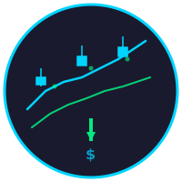

<div align="center">
  
  <h1>Stock Market Predictor</h1>
</div>

Production-oriented Indian market forecasting with direct multi-horizon return models, walk-forward validation, calibrated direction probabilities, and explicit uncertainty.

> This project is intended for my research and analytics system. It does not provide any investment/trading advice or guarantee future returns.


## Why The Forecasting Contract Changed

Raw future price is an unsuitable primary target for this product. It encourages a model to learn price level and persistence, makes errors difficult to compare across stocks, and can produce impressive metrics without a tradable signal.

The model will now predicts scale-independent forward return:

```
forward_return_h = Close[t + h] / Close[t] - 1
```

Each supported horizon has its own model:

```
1-day features > 1-day forward return model
3-day features > 3-day forward return model
5-day features > 5-day forward return model
```

The system does not generate synthetic future OHLCV rows. The 3-day and 5-day outputs are direct forecasts rather than recursive projections built from random market data.

## Current ML Pipeline

```
Yahoo Finance OHLCV
> data cleaning and chronological ordering
> technical and volatility feature generation
> direct forward-return targets
> purged expanding-window validation
> XGBoost and Random Forest return ensemble
> probability calibration from out-of-fold predictions
> residual-based prediction interval
> final model fit on all eligible historical samples
> deterministic 1/3/5-day forecast
```

### Ensemble

The current challenger ensemble remains:

```
expected_return = 0.70 * XGBoost + 0.30 * RandomForest
```

The algorithms are not treated as proven merely because they train successfully. Walk-forward results are compared with:

- zero-return forecast
- historical mean return forecast

If the ensemble does not beat the zero-return baseline, the output explicitly reports no demonstrated edge.

### Validation

Validation uses 'TimeSeriesSplit' with a gap equal to the forecast horizon. The gap prevents target overlap between the end of a training fold and the start of its validation fold.

Only out-of-fold results are used for public quality metrics. In-sample training scores are not presented as model performance.

Reported metrics include:

- return MAE
- return RMSE
- return R2, including negative values
- directional accuracy
- balanced directional accuracy
- calibrated-probability Brier score
- temporal calibration holdout Brier score when enough samples exist
- prediction interval coverage
- MAE improvement over zero-return baseline
- MAE comparison with historical-mean baseline

## Forecast Output

Each horizon output contains:

```
horizon
forecast date
expected return
derived forecast price
probability of positive return
prediction interval
Bullish / Bearish / Neutral model signal
Low / Medium / High confidence label
baseline comparison result
```

The forecast price is derived for presentation:

```
forecast_price = latest_close * (1 + expected_return)
```

Confidence is based on calibrated directional probability and interval width. It is not a claim of certainty.

## Feature Set

The current feature set includes:

- OHLCV and log returns
- simple and exponential moving averages
- normalized price-to-moving-average ratios
- RSI, MACD, stochastic oscillator, and ADX
- Bollinger Band position and width
- ATR and rolling historical volatility
- volume ratio, OBV, and volume price trend
- normalized momentum and rate of change
- lagged close, volume, and return observations
- limited price-pattern flags

Feature transforms are no longer fitted globally before validation. Missing-value imputation is fitted independently inside each training fold and reused for that fold's validation data.

## Sentiment Policy

Sentiment is optional and is never fabricated.

When 'NEWS_API_KEY' is configured, recent headlines are fetched and scored. When credentials are missing, the provider fails, or no scorable articles exist, the result is explicitly marked unavailable.

Text subjectivity is displayed as subjectivity, not mislabeled as confidence. Sentiment remains a separate informational output and is not included in model training.

## Architecture

Production destination separates ML, API, and presentation concerns:

```
Next.js frontend
      |
Versioned FastAPI service
      |
Python forecasting package
      |
      > market data providers
      > feature builder
      > model training and validation
      > model registry and prediction artifacts
```


## Data Sources And Research

- Yahoo Finance remains the initial MVP market data source.
- Official NSE archives and licensed feeds are preferred for production reliability.
- Kaggle datasets are suitable for offline research, not live production serving.
- Colab can accelerate experiments but is not a production scheduler or API host.


## License

MIT License. See [LICENSE](LICENSE).
